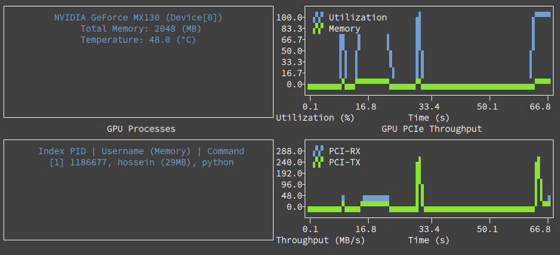

# GPU Monitoring Tool

A lightweight CLI tool to monitor GPU.

## Motivation
Current GPU monitoring tools often fall short in two key areas:

* Lack of PCI throughput metrics: RX and TX metrics are important, as data transfer between CPU and GPU is frequently the computational bottleneck.
* Inflexible metric selection: Users should be able to customize which metrics they need to measure, rather than being limited to predefined sets.

## Features (intended)
The following features are planned for this tool:

* Lightweight and minimal
* Basic metrics like GPU utilization, memory usage, PCI throughput, and processes
* Support monitoring multiple GPUs 
* Targeting Nvidia GPUs, with potential extension to AMD GPUs
* Allowing user-level customization 

## Installation
To install `gtop`, run the following command:
```bash
pip install --user .
```
This will install required dependencies and add `gtop` to your user-specific executable path (`~/.local/bin`). 
You can then run `gtop` directly.

To uninstall `gtop`, use the following command:
```bash
pip uninstall gtop
```

## Examples
A screenshot of `gtop` in action is shown below:



### Text-mode
Text mode can be enabled via `--text-mode` or `-t` flag:
```bash
$ gtop -t
CollectedMetrics(Time=0.10(s), PCI-TX=0.00(MB/s), PCI-RX=0.00(MB/s), Process=0.00(%), Memory=2.31(%))
CollectedMetrics(Time=1.13(s), PCI-TX=0.00(MB/s), PCI-RX=0.00(MB/s), Process=0.00(%), Memory=2.31(%))
...
CollectedMetrics(Time=10.14(s), PCI-TX=0.01(MB/s),  PCI-RX=42.37(MB/s), Process=100.00(%), Memory=3.74(%))
CollectedMetrics(Time=11.18(s), PCI-TX=11.02(MB/s), PCI-RX=0.03(MB/s),  Process=100.00(%), Memory=3.74(%))
```
